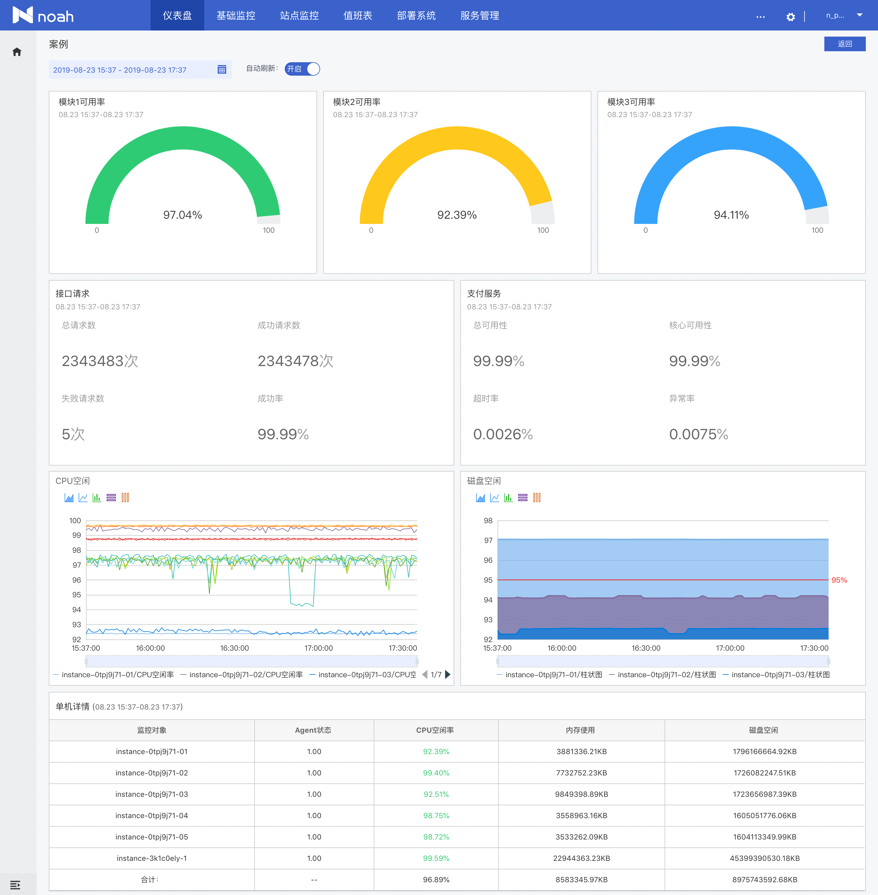

[[TOC]]
## 概述

仪表盘是NoahV主要的组成部分，也是我们提供的运维场景组件，只需按照格式提供相应的数据接口就能让你的项目拥有一整套可视化仪表盘功能，目前仪表盘提供功能主要有：

* 1.仪表盘管理，包含创建、编辑、删除、检索等功能
* 2.仪表盘布局拖动管理
* 3.可视化组件UI配置，目前支持趋势图、仪表图、数据面板、数据报表四种常见可视化组件
* 4.仪表盘刷新、全屏展示等功能

如下图所示为示例Dashboard,支持阈值和自定义颜色样式展示，轻松定位数据异常。

## 使用概览

目前仪表盘是作为场景组件整合在NoahV的仪表盘项目模板中，只包括展现层相关功能，所以如果需要接入仪表盘使用，需要按照格式提供仪表盘对应的数据接口，需要的数据接口列表以及格式参考[API接口](#/doc/view/api/api)部分文档。

得力于数据模拟的功能，我们的仪表盘示例配置好了完善的模拟数据，您可以直接使用模拟数据体验仪表盘的方便快捷和实用。具体请参考[快速使用](#/doc/view/quickstart)部分文档

仪表盘现支持趋势图、仪表图、数据面板、数据报表四种常见可视化组件，四种组件配置和使用方式请参考[可视化组件UI配置](#/doc/view/conf)部分文档
