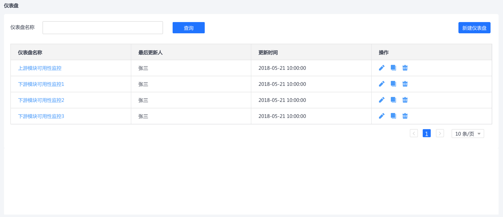
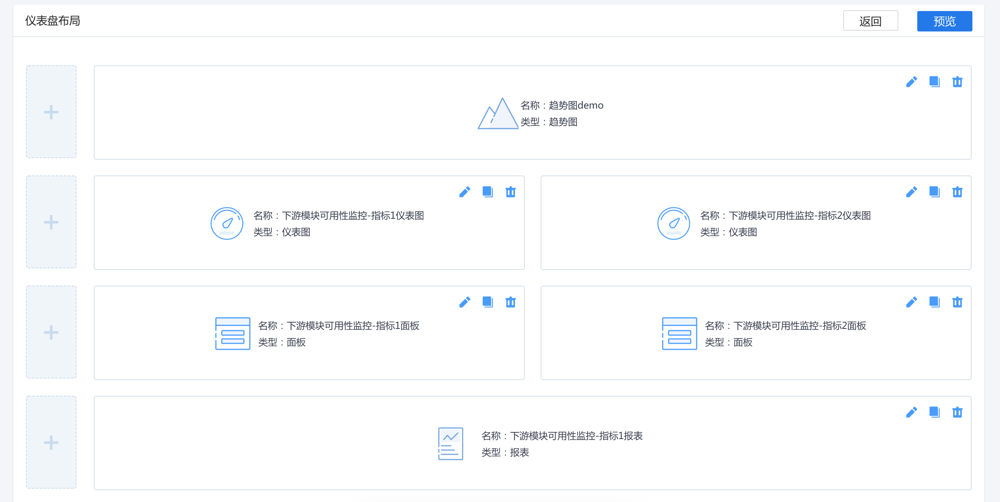

[[TOC]]
## 仪表盘
仪表盘功能的使用也依赖NoahV-cli脚手架，如果您本地还没有安装好，请参考[NoahV快速开始](#/guide/quickstart)相关文档，根据提示安装，如果已经安装过了并且本地运行`noahv -h`能看到NoahV的相关使用提示，说明本地NoahV环境已经安装好，请参照一下步骤使用仪表盘相关功能。


## 初始化仪表盘项目
使用noahv命令行工具初始化一个仪表盘项目


```
$  mkdir project && cd project && noahv init --dashboard
```

## 运行Demo示例


```
$  noahv start
```

在初始化之后的项目中运行上述命令，仪表盘Demo实例将会自动运行，查看打开的浏览器窗口，体验仪表盘相关功能(由于模拟数据的限制，更改可视化组件和仪表盘布局配置将无法生效，您可以手动修改模拟数据或者直接接入API)。

## 查看仪表盘Demo示例
1 如下图所示为仪表盘管理页面，管理着所有创建的仪表盘页面




2 如下图所示为仪表盘综合配置页面，可以点击加号添加行和列的组件，也可以直接复制组件配置，同时也可以跨行跨列拖动管理组件





3 如下图所示为组件UI配置界面，通过点击仪表盘综合配置页面中组件的配置按钮就可以看到该配置图


## 仪表盘代码目录结构
仪表盘项目和普通项目模板的代码结构基本是一致的，仪表盘项目在 `src` 目录下会多一个 `view` 文件夹，仪表盘相关代码逻辑和功能都在该目录中。

`view`下的文件机构如下图所示：

```
noahv-project
├── mockup
├── node_modules
├── scripts
├── src
│   ├── conmmon (配置，静态资源等内容)
│   ├── demo (运行demo文件目录，正式发布时可以删除) 
│   ├── store (vuex目录，具体请参考vuex官网)
│   ├── tools (工具模块)
│   └── view (仪表盘目录)
│        ├── api 
│        │    ├── config.js (仪表盘API地址配置信息)
│        │    └── widget.js (获取组件配置信息方法，提供给vuex)
│        ├── assets
│        │    ├── css (样式)
│        │    └── img (图片)
│        ├── util 
│        │    └── util.js (仪表盘工具方法类)
│        ├── widget 
│        │    ├── billboard (数据面板相关逻辑)
│        │    ├── common (公共方法或者通用逻辑)
│        │    ├── mdcircle (仪表图相关逻辑)
│        │    ├── mdreport (报表相关逻辑)
│        │    ├── mdtrend (趋势图相关逻辑)
│        │    ├── configuration.vue (组件UI配置模板)
│        │    ├── edit.vue (组件编辑相关逻辑)
│        │    └── widget.vue (综合配置页面的组件逻辑)
│        ├── edit.vue (综合配置页面相关逻辑)
│        ├── list.vue (列表页面相关逻辑)
│        └── view.vue (仪表盘展示页面相关逻辑)
│
├── build.sh (编译脚本)
├── index.html (静态模板)
├── package.json (依赖管理)
└── README.md 
```


只需根据`api/config.js`提供API接口即可，关于具体有哪些API接口，以及各个接口的参数格式请参考[API接口](#/doc/view/api/api)文档


