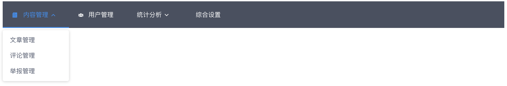
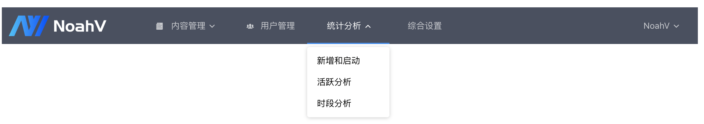

[[TOC]]

## 概述

本章节主要介绍如何通过一些配置实现导航栏菜单的自定义化展示。


## header.js 配置说明

| 属性         | 说明                                           | 类型              | 默认值      |
| ------------ | ---------------------------------------------- | ----------------- | ----------- |
| header       | 必填项，设置导航栏的菜单项，详见基础示例       | Array             | -           |
| hasBread     | 是否启用面包屑导航                             | Boolean           | true        |
| logo         | 必填项，设置网站logo，详见组合示例和下方说明   | Boolean           | -           |
| login        | 设置登录菜单，详见组合示例和下方说明           | Object            | -           |
| type         | 设置导航显示的方式，支持header和header-sidebar | String            | header      |
| separator    | 面包屑分隔符 | String            | /      |

### header配置

header是一个数组，可以通过children配置二级、三级菜单，当选择header类型`header-sidebar`时，菜单最多嵌套三层。

| 属性         | 说明                                   | 类型              | 默认值      |
| ------------ | -------------------------------------- | --------------    | ----------- |
| label      | 显示内容                   | string           | -           |
| key        | 全局唯一的标识 | String            | -           |
| type        | label前面展示的icon,可以缺省,[可以使用的icon列表](#/doc/component/icon)                     | String            | -           |
| link          | 菜单对应的页面地址，对应的为router中的path                     | String            | -           |
| children          | 子菜单，可以缺省                    | array            | -           |

<br>

*注意：对于菜单子节点我们推荐link和key保持一致，如果当前菜单还有子菜单，并且希望点击当前菜单的时候默认跳转到某个子菜单节点，请配置link为子节点的地址，这时候请给父节点取一个唯一的标识(不能和link一致)*


<br>

### logo配置

| 属性         | 说明                                   | 类型              | 默认值      |
| ------------ | -------------------------------------- | --------------    | ----------- |
| hasLogo      | 是否需要启用网站logo                   | Boolean           | -           |
| title        | 鼠标放到logo上时的悬浮提示，hasLogo为false时，显示title替代logo | String            | -           |
| src          | logo图片的源地址                       | String            | -           |
| link          | 点击logo跳转地址                       | String            | -           |


### login配置

| 属性         | 说明                                   | 类型              | 默认值      |
| ------------ | -------------------------------------- | --------------    | ----------- |
| hasLogin     | 是否启用登录菜单                       | Boolean           | -           |
| url          | 登录获取用户信息的API                   | String            | -           |
| logout       | 退出登录的地址                         | String            | -           |
| subnav       | 登录菜单的下拉子菜单，详见组合示例和下方说明| Array        | -           |

### subNav配置

| 属性         | 说明                                   | 类型              | 默认值      |
| ------------ | -------------------------------------- | --------------    | ----------- |
| label        | 菜单项名称                             | Boolean           | -           |
| key          | 菜单项的标识，须全局唯一               | String            | -           |
| link         | 点击菜单项，跳转到的页面地址           | String            | -           |
| linkTarget   | 点击菜单项，跳转到的页面地址，新开一个tab页 | String       | -           |


## 基础示例

头部导航和侧导航栏，主要通过配置headerConfig.js和routerConfig.js两个文件实现，其所在目录位置见[目录结构](#/guide/catalog)一章。





```javascript
/**
 * headerConfig.js的配置示例
 *
 * 注意：key必须全局唯一
 */

export const viewLayoutConfig = {
    header: [
        {
            label: '内容管理',
            key: 'contentManage',
            link: 'contentManage/index',
            type: 'file',
            children: [
                {
                    label: '文章管理',
                    key: 'contentManage/articleManage',
                    link: 'contentManage/articleManage'
                },
                {
                    label: '评论管理',
                    key: 'contentManage/commentManage',
                    link: 'contentManage/commentManage'
                },
                {
                    label: '举报管理',
                    key: 'contentManage/reportManage',
                    link: 'contentManage/reportManage'
                }
            ]
        },
        {
            label: '用户管理',
            key: 'userManage',
            link: 'userManage/index',
            type: 'users'
        },
        {
            label: '统计分析',
            key: 'statisticalAnalysis',
            link: 'statisticalAnalysis/index',
            type: 'place',
            children: [
                {
                    label: '新增和启动',
                    key: 'statisticalAnalysis/new',
                    link: 'statisticalAnalysis/new'
                },
                {
                    label: '活跃分析',
                    key: 'statisticalAnalysis/active',
                    link: 'statisticalAnalysis/active'
                },
                {
                    label: '时段分析',
                    key: 'statisticalAnalysis/stage',
                    link: 'statisticalAnalysis/stage'
                }
            ]
        },
        {
            label: '综合设置',
            key: 'comprehensiveConfig',
            link: 'comprehensiveConfig/index',
            type: 'set'
        }
    ],
    // 是否需要面包屑
    hasBread: false
};


```


## 侧导航示例

本框架的说明文档即一个较为完善的侧导航示例。下面给出其headerConfig.js的配置。


```javascript
/**
 * headerConfig.js的配置示例
 *
 * 只需要在最后指定type='header-sidebar'，即可得到侧导航
 * 其他配置与基础示例中相同
 */

export const viewLayoutConfig = {
    header: [
        {
            label: '开发指南',
            key: 'devStart',
            link: 'quickstart/index',
            children: [
                {
                    label: '关于NoahV',
                    key: 'intro/index',
                    link: 'intro/index'
                },
                {
                    label: '快速开始',
                    key: 'quickstart/index',
                    link: 'quickstart/index'
                },
                {
                    label: '目录结构',
                    key: 'quickstart/catalog',
                    link: 'quickstart/catalog'
                },
                {
                    label: '菜单配置',
                    key: 'quickstart/menu',
                    link: 'quickstart/menu'
                },
                {
                    label: '模板使用',
                    key: 'quickstart/tpl',
                    link: 'quickstart/tpl'
                },
                {
                    label: '编译部署',
                    key: 'quickstart/deploy',
                    link: 'quickstart/deploy'
                }
            ]
        },
        {
            label: '设计规范',
            key: 'basic',
            link: 'color/index',
            children: [
                {
                    label: '色彩',
                    key: 'color/index',
                    link: 'color/index'
                }
            ]
        },
        {
            label: '组件',
            key: 'doc/component',
            link: 'doc/component/icon',
            children: [
                {
                    label: 'icon',
                    key: 'doc/component/icon',
                    link: 'doc/component/icon'
                },
                {
                    label: '日历组件',
                    key: 'doc/component/date-picker',
                    link: 'doc/component/date-picker'
                },
                {
                    label: '带行号的文本框',
                    key: 'doc/component/text-line',
                    link: 'doc/component/text-line'
                }
            ]
        },
        {
            label: '模板',
            key: 'doc/template',
            link: 'doc/template/basic-table',
            children: [
                {
                    label: '表格模板',
                    key: 'doc/template/table',
                    children: [
                        {
                            label: '基础表格',
                            key: 'doc/template/basic-table',
                            link: 'doc/template/basic-table'
                        },
                        {
                            label: '筛选表格',
                            key: 'doc/template/filter-table',
                            link: 'doc/template/filter-table'
                        }
                    ]
                },
                {
                    label: '表单模板',
                    key: 'doc/template/form',
                    link: 'doc/template/form'
                },
                {
                    label: '对比趋势图模板',
                    key: 'doc/template/contrast-trend',
                    link: 'doc/template/contrast-trend'
                }
            ]
        }
    ],
    // 是否需要面包屑
    hasBread: true,
    logo: {
        // 是否需要logo
        hasLogo: false,
        title: 'NoahV文档',
        src: require('config/common/assets/img/logo.png')
    },
    // header/header-sidebar
    type: 'header-sidebar'
};


```


## 组合示例




```javascript
/**
 * headerConfig.js的配置示例
 *
 */

export const viewLayoutConfig = {
    header: [
        {
            label: '内容管理',
            key: 'contentManage',
            link: 'contentManage/index',
            children: [
                {
                    label: '文章管理',
                    key: 'contentManage/articleManage',
                    link: 'contentManage/articleManage'
                },
                {
                    label: '评论管理',
                    key: 'contentManage/commentManage',
                    link: 'contentManage/commentManage'
                },
                {
                    label: '举报管理',
                    key: 'contentManage/reportManage',
                    link: 'contentManage/reportManage'
                }
            ]
        },
        {
            label: '用户管理',
            key: 'userManage',
            link: 'userManage/index'
        },
        {
            label: '统计分析',
            key: 'statisticalAnalysis',
            link: 'statisticalAnalysis/index',
            children: [
                {
                    label: '新增和启动',
                    key: 'statisticalAnalysis/new',
                    link: 'statisticalAnalysis/new'
                },
                {
                    label: '活跃分析',
                    key: 'statisticalAnalysis/active',
                    link: 'statisticalAnalysis/active'
                },
                {
                    label: '时段分析',
                    key: 'statisticalAnalysis/stage',
                    link: 'statisticalAnalysis/stage'
                }
            ]
        },
        {
            label: '综合设置',
            key: 'comprehensiveConfig',
            link: 'comprehensiveConfig/index'
        }
    ],
    // 是否需要面包屑
    hasBread: false,
    logo: {
        // 是否需要logo
        hasLogo: true,
        title: '百度云',
        src: require('../filepath/logo.png')
    },
    login: {
        // hasLogin 是否需要登录菜单
        hasLogin: true,
        // 登录获取用户信息的API
        login: '/api/filepath/username?format=json',
        // // 退出登录的地址
        logout: '/api/filepath/accounts/logout',
        subnav: [
            {
                label: '个人中心',
                key: 'personalCenter',
                link: 'personalCenter'
            }, 
            {
                label: '账户管理',
                key: 'accoutManage',
                link: 'accoutManage'
            },
            {
                label: '智能客服',
                key: 'customService',
                link: 'customService'
            }
        ]
    },

};
```
